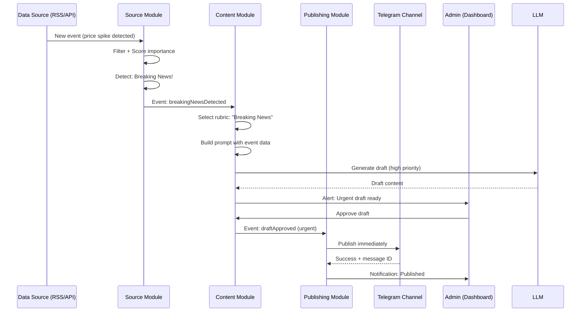

# PRD: TG Operations Manager — Unified Specification

**Version:** 1.0
**Status:** Final
**Product Type:** Internal tool → SaaS platform
**Primary Language:** English
**Target Channel:** Ukrainian Investor (financial news, crypto analytics, investment insights)

---

## 1. Executive Summary

**TG Operations Manager** is an AI-powered content operations platform for Telegram channel owners. It automates the complete content lifecycle: multi-source data ingestion → LLM-powered content generation → editorial review → scheduled publishing → performance analytics.

**First Use Case:** "Ukrainian Investor" — a Ukrainian-language Telegram channel covering:
- Stock market movements
- Crypto analytics
- Investment advice
- Breaking financial news

**Business Value:**
- Reduce channel operation time by 70%+
- Decrease event-to-publish latency to <5 minutes for breaking news
- Increase posting consistency and frequency
- Build scalable foundation for SaaS multi-tenant platform

---

## 2. Vision & Strategic Goals

### Vision
Build an intelligent operations platform that transforms how Telegram channels operate — from fragmented manual workflows to systematic AI-assisted content operations with continuous learning and performance optimization.

### Strategic Goals

| # | Goal | MVP Success Criteria |
|---|------|---------------------|
| 1 | Automate content creation | ≥80% of posts generated automatically |
| 2 | Minimize breaking news latency | Breaking news published within ≤5 minutes |
| 3 | Maintain authentic channel voice | ≥70% of generated posts approved without edits |
| 4 | Enable no-code configuration | New rubric added without code changes |
| 5 | Build SaaS-ready foundation | Plugin-based, tenant-aware architecture |

### Product Principles

1. **Human-in-the-loop first** — No forced autopublishing; quality over speed
2. **Source-first, not model-first** — Value depends on source quality + filtering + workflow
3. **Configurable by design** — Rubrics, sources, thresholds, tone, publishing rules
4. **Analytics must drive automation** — System learns what works
5. **No hard financial advice by default** — Informative analysis, not trading signals

---

## 3. Problem Statement

Running an investment/business Telegram channel is a fragmented manual workflow:
- News comes from multiple sources (RSS, Telegram channels, market APIs)
- Relevant events must be filtered quickly
- Content must be rewritten in consistent channel style
- Urgent events cannot be missed
- Duplicate coverage should be avoided
- Owner needs feedback on which rubrics, sources, and patterns drive engagement

**Result:** Channel owners either spend excessive time on operations OR run channels inconsistently.

---

## 4. Target Audience

### Primary User (MVP)
**Solo Telegram channel owner/operator** in niches:
- Investing & Finance
- Business & Economics
- Crypto & Web3
- Macro / geopolitical market analysis

**Characteristics:**
- Runs channel personally
- Wants to reduce repetitive manual work
- Needs to react fast to important events
- Wants data on content performance

### Future Users (SaaS Phase)
- SMM agencies managing multiple client channels
- Media startups launching niche content channels
- Influencers maintaining posting consistency
- Content teams (editor, analyst, channel manager)

---

## 5. User Stories & Functional Requirements

### Epic 1: Data Source Management

| ID | User Story | Priority |
|----|-----------|----------|
| US-1.1 | As admin, I want to connect a Telegram channel as news source so the system ingests its messages | 🔴 Must |
| US-1.2 | As admin, I want to add RSS/web feeds to pull news from websites | 🟡 Should |
| US-1.3 | As admin, I want to connect market data APIs (Binance, CoinGecko, Finnhub) to get live prices | 🔴 Must |
| US-1.4 | As admin, I want to set keyword/topic filters per source so only relevant content is ingested | 🟡 Should |
| US-1.5 | As admin, I want to manually inject content (paste link/text) to generate candidate posts | 🟡 Should |

**Source Strategy (MVP Recommended):**
- **RSS Feeds:** Reuters, Investing.com (reliable, timely)
- **Crypto APIs:** CoinGecko (free tier, comprehensive)
- **Stock/Macro APIs:** Finnhub or Alpha Vantage (quotes, news, indicators)
- **Manual Input:** Owner-submitted content
- **Telegram Sources:** Future phase (requires client API complexity)

### Epic 2: Rubrics & Content Generation

| ID | User Story | Priority |
|----|-----------|----------|
| US-2.1 | As admin, I want to create rubrics (name, prompt template, schedule, sources) for automatic content generation | 🔴 Must |
| US-2.2 | As admin, I want to preview posts before publishing to maintain quality control | 🔴 Must |
| US-2.3 | As admin, I want full auto-publish mode for specific rubrics so routine posts need no manual intervention | 🟡 Should |
| US-2.4 | As admin, I want the system to detect breaking news in real-time and auto-generate posts immediately | 🔴 Must |
| US-2.5 | As admin, I want analytical posts with market data/charts so I deliver high-value content | 🟡 Should |
| US-2.6 | As admin, I want to regenerate posts with variations (shorter, sharper, more detailed) | 🟡 Should |

**Base Rubrics (MVP):**
1. **Breaking News** — Urgent, short, factual (auto-alert mode)
2. **Market Move Analysis** — Detailed, with context, explanation
3. **Daily Digest** — Aggregated news, bullet points
4. **Educational Explainer** — Term/concept explanation
5. **"What It Means for Investors"** — Practical implications
6. **Weekly Summary** — Week recap

### Epic 3: Style Learning & Voice Consistency

| ID | User Story | Priority |
|----|-----------|----------|
| US-3.1 | As admin, I want to import channel post archive so LLM learns existing tone and style | 🟡 Should |
| US-3.2 | As admin, I want to give feedback (👍/👎 + comments) on posts so the system improves | 🔴 Must |
| US-3.3 | As admin, I want the system to learn from my manual edits and incorporate patterns | 🟡 Should |
| US-3.4 | As admin, I want to define channel voice profile (tone, length, emoji usage) for new channels | 🔴 Must |

**Style Learning Approach (MVP):**
- Since channel doesn't exist yet, focus on **configurable voice profile**
- Owner defines: tone (neutral/sharp/expert), length (short/medium/long), emoji rules
- Feedback loop: good/too generic/too long/weak hook/too risky
- Later: retrieval over approved content, adaptive prompt optimization

### Epic 4: Publishing & Scheduling

| ID | User Story | Priority |
|----|-----------|----------|
| US-4.1 | As admin, I want to set cron-based auto-publishing per rubric so content goes live on schedule | 🔴 Must |
| US-4.2 | As admin, I want breaking news to bypass schedule and publish instantly (after review) | 🔴 Must |
| US-4.3 | As admin, I want moderation queue where I approve/edit/reject posts before publishing | 🟡 Should |
| US-4.4 | As admin, I want to reschedule posts via drag-and-drop calendar | 🟢 Nice |

**Publish Modes:**
- `auto` — Publish immediately (breaking news, low-risk rubrics)
- `moderation` — Queue for review (default mode)
- `manual` — Draft only, owner publishes manually

### Epic 5: Analytics & Performance

| ID | User Story | Priority |
|----|-----------|----------|
| US-5.1 | As admin, I want post-level stats (views, reactions, forwards) to understand content performance | 🟡 Should |
| US-5.2 | As admin, I want per-rubric aggregate metrics to optimize content strategy | 🟢 Nice |
| US-5.3 | As admin, I want source effectiveness metrics (which sources drive best posts) | 🟡 Should |
| US-5.4 | As admin, I want best-time-to-post suggestions based on historical performance | 🟢 Nice |

**Analytics Strategy (MVP):**
- **Internal analytics first:** track all operations internally
- **Telegram stats integration:** separate adapter layer (don't block MVP)
- **Owner-oriented metrics:** reach, subscriber growth, source performance, rubric performance, latency

### Epic 6: Safety & Policy Controls

| ID | User Story | Priority |
|----|-----------|----------|
| US-6.1 | As admin, I want policy modes per rubric (informative/analysis/no-recommendations) | 🟡 Should |
| US-6.2 | As admin, I want mandatory disclaimers for financial rubrics | 🔴 Must |
| US-6.3 | As admin, I want speculative-claim flagging before publishing | 🟡 Should |
| US-6.4 | As admin, I want source confidence indicators on drafts | 🟢 Nice |

---

## 6. Architecture & Technical Design

### 6.1 Architecture — Modular Monolith

A single NestJS application with strictly isolated domain modules. Modules communicate via exported service interfaces and in-process events (EventEmitter2).

**Why modular monolith?**
- Single-process deployment → minimal ops overhead for solo developer
- Fast iteration during MVP stage
- Modules already isolated → zero business-logic rewrite to migrate to microservices
- No premature infrastructure complexity

**Future path:** Extract module → replace EventEmitter2 with RabbitMQ/NATS → deploy independently

```
┌──────────────────────────────────────────────────────────────┐
│                       Web Dashboard                          │
│                     (React / Next.js)                        │
└──────────────────────────┬───────────────────────────────────┘
                           │  REST API + WebSocket
┌──────────────────────────▼───────────────────────────────────┐
│                NestJS — Modular Monolith                      │
│                                                              │
│  ┌──────────────┐  ┌──────────────┐  ┌──────────────┐        │
│  │   Source     │  │   Content    │  │  Publishing  │        │
│  │   Module     │  │   Module     │  │   Module     │        │
│  │              │  │              │  │              │        │
│  │ · TG Reader  │  │ · LLM Svc   │  │ · TG Bot     │        │
│  │ · RSS Poller │  │ · Rubrics    │  │ · Scheduler  │        │
│  │ · Market API │  │ · Style      │  │ · Queue      │        │
│  │ · Filters    │  │   Learning   │  │              │        │
│  └──────┬───────┘  └──────┬───────┘  └──────┬───────┘        │
│         │                 │                 │                │
│  ┌──────▼─────────────────▼─────────────────▼──────────┐     │
│  │              Shared / Core Module                    │     │
│  │  Auth · Config · Logger · EventEmitter2 · Guards     │     │
│  └─────────────────────────────────────────────────────┘     │
│                                                              │
│  ┌──────────────┐  ┌──────────────┐                          │
│  │  Analytics   │  │  Dashboard   │                          │
│  │  Module      │  │  API Module  │                          │
│  └──────────────┘  └──────────────┘                          │
└──────────┬──────────────────┬────────────────────────────────┘
           │                  │
  ┌────────▼─────┐   ┌───────▼─────────┐
  │  PostgreSQL  │   │     Redis       │
  │  (Prisma)    │   │ (Cache + BullMQ)│
  └──────────────┘   └─────────────────┘
```

### 6.2 Tech Stack

| Layer | Technology | Version | Notes |
|-------|-----------|---------|-------|
| Backend Runtime | Node.js | 20+ | Long-term support |
| Language | TypeScript | 5+ | Strict mode enabled |
| Backend Framework | NestJS | 10+ | Modular monolith architecture |
| ORM / Database | Prisma + PostgreSQL | Latest + 16 | Type-safe queries, migrations |
| Cache & Queue | Redis + BullMQ | 7+ | Job scheduling, caching |
| Inter-module Events | EventEmitter2 | Latest | In-process, swappable to MQ |
| LLM Integration | OpenAI SDK / Google AI SDK | Latest | Behind `LLMProvider` interface |
| TG Channel Reading | gramjs | Latest | Telegram Client API (MTProto) |
| TG Publishing | grammy | Latest | Telegram Bot API |
| Frontend | Next.js + React | 14 + 18 | App Router, Server Components |
| UI Components | shadcn/ui or Tailwind CSS | Latest | Responsive, accessible |
| State Management | TanStack Query (React Query) | Latest | Server state management |
| Hosting | VPS + Docker Compose | - | Single `docker compose up` |
| CI/CD | GitHub Actions | - | Lint → Test → Build → Deploy |

### 6.3 Module Breakdown

#### **Source Module** 🔴 Critical
**Responsibility:** Data ingestion, filtering, breaking-news detection

**Services:**
- `TelegramReaderService` — gramjs client for reading Telegram channels
- `RssPollerService` — Polling RSS/web feeds on intervals
- `MarketDataService` — Binance, CoinGecko, Finnhub API integration
- `FilterService` — Keyword matching, topic classification, importance scoring
- `BreakingNewsDetector` — Rule-based + anomaly detection (price spike > X%, keyword surge)

**Events Emitted:**
- `dataSourceEventDetected` — New event ingested and passed filtering
- `breakingNewsDetected` — Urgent event requiring immediate draft generation

#### **Content Module** 🔴 Critical
**Responsibility:** LLM orchestration, rubric management, draft generation

**Services:**
- `LLMProviderService` — Abstract interface for LLM providers
- `OpenAIService` — GPT-4o implementation
- `GeminiService` — Google Gemini implementation
- `RubricService` — CRUD for rubrics, prompt template management
- `PromptService` — Variable injection, few-shot example selection
- `DraftGenerationService` — Orchestrate draft creation from events

**Interfaces:**
```typescript
interface LLMProvider {
  generate(prompt: string, config: LLMConfig): Promise<string>;
  generateStream(prompt: string, config: LLMConfig): AsyncIterable<string>;
  estimateTokens(text: string): number;
}
```

**Events Emitted:**
- `draftCreated` — New draft ready for review
- `draftRegenerated` — Draft regenerated with variations

**Events Listened:**
- `dataSourceEventDetected` → Trigger draft generation
- `breakingNewsDetected` → Priority draft generation

#### **Style Learning Module** 🟡 High
**Responsibility:** Channel voice extraction, feedback processing, adaptive prompts

**Services:**
- `StyleProfileService` — Extract and maintain style fingerprints
- `FeedbackService` — Process admin feedback (👍/👎 + comments)
- `FewShotService` — Select best example posts for prompts
- `ArchiveImportService` — Bulk import historical posts

**Data:**
- Tone descriptors, formatting rules, emoji usage
- Average post length, vocabulary fingerprint
- Example post IDs for few-shot prompting

#### **Publishing Module** 🔴 Critical
**Responsibility:** Telegram bot publishing, scheduling, queue management

**Services:**
- `TelegramBotService` — grammy bot for posting to channels
- `SchedulerService` — BullMQ repeatable jobs with cron expressions
- `QueueService` — Priority queue (breaking news → urgent → normal)
- `PublishOrchestrator` — Coordinate publish workflow

**Publish Modes:**
- `auto` — Publish immediately
- `moderation` — Queue for review
- `manual` — Draft only

**Events Listened:**
- `draftApproved` → Publish or schedule
- `breakingNewsDetected` → Bypass queue, publish immediately

#### **Analytics Module** 🟡 High
**Responsibility:** Performance tracking, metrics aggregation

**Services:**
- `MetricsCollectorService` — Collect stats from Telegram API (views, reactions, forwards)
- `AggregationService` — Per-rubric, per-source, time-based aggregates
- `AnalyticsQueryService` — Query interface for dashboard

**Metrics (MVP):**
- Post-level: views, reactions, forwards, publish latency
- Rubric-level: avg performance, approval rate, regeneration rate
- Source-level: event-to-post conversion, top-performing sources
- Channel-level: subscriber growth, posting frequency

#### **Dashboard API Module** 🟡 High
**Responsibility:** REST API + WebSocket for frontend

**Controllers:**
- `ChannelController` — CRUD for channels
- `SourceController` — CRUD for data sources, test connection
- `RubricController` — CRUD for rubrics, prompt editor
- `DraftController` — Draft queue management, approve/reject/edit
- `AnalyticsController` — Query metrics
- `SettingsController` — LLM provider config, global settings

**WebSocket Events:**
- `newDraftArrived` — Real-time draft notifications
- `postPublished` — Real-time publish confirmations
- `breakingNewsAlert` — Urgent alerts to admin

#### **Shared/Core Module** 🔴 Critical
**Responsibility:** Cross-cutting concerns

**Includes:**
- Authentication (JWT, guards, strategies)
- Configuration management (`@nestjs/config`)
- Logging (Pino with correlation IDs)
- Database service (Prisma client)
- Event definitions and types
- Shared interfaces (`LLMProvider`, `PlatformPublisher`)
- Utilities (retry logic, encryption, validation)

---

## 7. Data Model

### 7.1 Core Entities

```prisma
model Workspace {
  id        String    @id @default(uuid())
  name      String
  ownerId   String
  channels  Channel[]
  createdAt DateTime  @default(now())
  updatedAt DateTime  @updatedAt
}

model Channel {
  id              String         @id @default(uuid())
  workspaceId     String
  workspace       Workspace      @relation(fields: [workspaceId], references: [id])
  name            String
  telegramChatId  String         @unique
  botToken        String         // Encrypted at rest
  timezone        String         @default("UTC")
  settings        Json?
  styleProfile    StyleProfile?
  rubrics         Rubric[]
  tenantId        String         // Multi-tenancy readiness
  createdAt       DateTime       @default(now())
  updatedAt       DateTime       @updatedAt

  @@index([tenantId])
  @@index([workspaceId])
}

model DataSource {
  id               String       @id @default(uuid())
  type             SourceType   // telegram | rss | market_api | web | manual
  name             String
  connectionConfig Json         // API keys, URLs, etc.
  filterRules      Json?        // Keywords, topics, importance thresholds
  isActive         Boolean      @default(true)
  reliability      Float        @default(1.0) // 0.0-1.0 score
  rubrics          Rubric[]     @relation("RubricDataSources")
  tenantId         String
  createdAt        DateTime     @default(now())
  updatedAt        DateTime     @updatedAt

  @@index([tenantId])
  @@index([type])
}

model Rubric {
  id             String           @id @default(uuid())
  channelId      String
  channel        Channel          @relation(fields: [channelId], references: [id], onDelete: Cascade)
  name           String
  description    String?
  promptTemplate String           @db.Text
  publishMode    PublishMode      @default(moderation) // auto | moderation | manual
  policyMode     PolicyMode       @default(informative) // informative | analysis | cautious
  isActive       Boolean          @default(true)
  priority       Int              @default(0) // Higher = more important
  dataSources    DataSource[]     @relation("RubricDataSources")
  schedules      ScheduleConfig[]
  posts          Post[]
  tenantId       String
  createdAt      DateTime         @default(now())
  updatedAt      DateTime         @updatedAt

  @@index([channelId])
  @@index([tenantId])
}

model ScheduleConfig {
  id             String   @id @default(uuid())
  rubricId       String
  rubric         Rubric   @relation(fields: [rubricId], references: [id], onDelete: Cascade)
  cronExpression String   // e.g., "0 9 * * *" for daily 9am
  timezone       String   @default("UTC")
  isActive       Boolean  @default(true)
  createdAt      DateTime @default(now())
  updatedAt      DateTime @updatedAt

  @@index([rubricId])
}

model Post {
  id              String     @id @default(uuid())
  rubricId        String
  rubric          Rubric     @relation(fields: [rubricId], references: [id])
  content         String     @db.Text
  status          PostStatus @default(draft) // draft | queued | published | rejected
  publishMode     PublishMode // auto | moderation | manual
  metadata        Json?      // Source attribution, LLM config, generation time
  publishedAt     DateTime?
  scheduledFor    DateTime?
  telegramPostId  String?    // Telegram message ID after publishing
  views           Int        @default(0)
  reactions       Int        @default(0)
  forwards        Int        @default(0)
  feedbacks       Feedback[]
  versions        PostVersion[]
  tenantId        String
  createdAt       DateTime   @default(now())
  updatedAt       DateTime   @updatedAt

  @@index([rubricId])
  @@index([status])
  @@index([tenantId])
  @@index([publishedAt])
}

model PostVersion {
  id        String   @id @default(uuid())
  postId    String
  post      Post     @relation(fields: [postId], references: [id], onDelete: Cascade)
  content   String   @db.Text
  version   Int
  reason    String?  // "initial" | "regenerated" | "edited" | "feedback"
  createdAt DateTime @default(now())

  @@index([postId])
}

model Feedback {
  id            String       @id @default(uuid())
  postId        String
  post          Post         @relation(fields: [postId], references: [id], onDelete: Cascade)
  rating        FeedbackRating // positive | negative
  category      String?      // "too_generic" | "too_long" | "weak_hook" | "too_risky" | "perfect"
  comment       String?      @db.Text
  editedContent String?      @db.Text // If admin manually edited
  createdAt     DateTime     @default(now())

  @@index([postId])
}

model StyleProfile {
  id               String   @id @default(uuid())
  channelId        String   @unique
  channel          Channel  @relation(fields: [channelId], references: [id], onDelete: Cascade)
  toneDescriptors  Json     // ["professional", "sharp", "data-driven"]
  formattingRules  Json     // {"emoji": "minimal", "paragraphs": "short"}
  examplePostIds   Json     // Array of Post IDs for few-shot
  avgPostLength    Int      @default(500)
  vocabularyFingerprint Json? // Top keywords, phrases
  createdAt        DateTime @default(now())
  updatedAt        DateTime @updatedAt

  @@index([channelId])
}

model AnalyticsSnapshot {
  id           String   @id @default(uuid())
  entityType   String   // "channel" | "rubric" | "source" | "post"
  entityId     String
  metricType   String   // "views" | "subscribers" | "conversion_rate" | etc.
  metricValue  Float
  aggregation  String?  // "daily" | "weekly" | "monthly"
  snapshotDate DateTime @default(now())
  metadata     Json?
  tenantId     String
  createdAt    DateTime @default(now())

  @@index([entityType, entityId])
  @@index([tenantId])
  @@index([snapshotDate])
}

// Enums
enum SourceType {
  telegram
  rss
  market_api
  web
  manual
}

enum PublishMode {
  auto
  moderation
  manual
}

enum PolicyMode {
  informative       // No recommendations
  analysis          // Analysis allowed, no explicit advice
  cautious          // High caution, mandatory disclaimers
}

enum PostStatus {
  draft
  queued
  published
  rejected
  archived
}

enum FeedbackRating {
  positive
  negative
}
```

### 7.2 Key Relationships

- `Workspace` (1) → (N) `Channel` — Multi-channel support
- `Channel` (1) → (N) `Rubric` — Multiple content formats per channel
- `Channel` (1) → (1) `StyleProfile` — Consistent voice
- `Rubric` (N) ↔ (N) `DataSource` — Multiple sources per rubric
- `Rubric` (1) → (N) `ScheduleConfig` — Multiple schedules per rubric
- `Rubric` (1) → (N) `Post` — Generated content
- `Post` (1) → (N) `Feedback` — Learning loop
- `Post` (1) → (N) `PostVersion` — Edit history

---

## 8. Non-Functional Requirements

### 8.1 Performance

| Metric | Target | Notes |
|--------|--------|-------|
| Normal draft generation | <60 seconds | Average case with LLM call |
| Urgent draft generation | <30 seconds | Breaking news, high priority |
| Publish after approval | <5 seconds | Near real-time |
| Dashboard page load | <2 seconds | Common UI interactions |
| Breaking news latency | <5 minutes | From event detection → published |

### 8.2 Scalability

**MVP (Single User):**
- 1 workspace, 1-3 channels
- 10-20 data sources
- 5-10 rubrics
- 50-100 posts/day

**Phase 2 (Multi-User):**
- 10+ workspaces
- 50+ channels
- 100+ data sources
- 500+ posts/day

**Scalability Principles:**
- Separate connector workers from publishing workers
- Queue-based pipeline (BullMQ)
- Stateless API layer
- Per-source rate limiting
- Per-rubric generation quotas

### 8.3 Reliability

**Targets:**
- MVP uptime: ≥99.0%
- No silent publishing failures (always log + alert)
- Recoverable processing for broken source jobs

**Strategies:**
- Retry with exponential backoff for LLM and Telegram API calls
- Dead-letter queue (DLQ) for failed BullMQ jobs
- Structured logging (Pino) with correlation IDs
- Health-check endpoints per module (`/health`, `/ready`)
- Graceful shutdown (drain queue, close DB connections)

### 8.4 Security

- JWT-based authentication (access + refresh tokens)
- Third-party API keys encrypted at rest (AES-256-GCM)
- Rate limiting on all API endpoints (express-rate-limit + Redis)
- RBAC (Admin/Editor/Viewer roles) for SaaS phase
- Input sanitization (class-validator, ValidatorPipe)
- Helmet middleware for HTTP hardening

### 8.5 Maintainability

**Code Quality:**
- TypeScript strict mode
- ESLint + Prettier
- Code coverage >70% for core modules
- Comprehensive inline documentation

**Architecture:**
- Clear domain separation (modules)
- Event-driven communication (decoupled)
- Interface-based design (LLM providers, platform publishers)
- Versioned prompts (track prompt changes)
- Feature flags for gradual rollouts

---

## 9. Roadmap

### Phase 1 — MVP (4-6 weeks)

**Week 1-2: Foundation**
- [x] NestJS project setup, Prisma schema
- [x] Docker Compose (PostgreSQL, Redis)
- [ ] Shared/Core Module (Auth, Config, Logger, Prisma)
- [ ] Base module scaffolding (Source, Content, Publishing)

**Week 3-4: Core Modules**
- [ ] Source Module: RSS + Market API + Manual input
- [ ] Content Module: LLM providers (OpenAI, Gemini), Rubric service
- [ ] Publishing Module: Telegram Bot (grammy), Scheduler (BullMQ)
- [ ] Breaking news detection pipeline

**Week 5-6: Dashboard + Integration**
- [ ] Dashboard API (REST + WebSocket)
- [ ] Frontend: Channels, Sources, Rubrics, Draft Queue
- [ ] End-to-end workflow testing
- [ ] MVP deployment

### Phase 2 — Smart Content (2-3 weeks)

- [ ] Style Learning Module (feedback system, few-shot prompting)
- [ ] Post archive import for style training
- [ ] Regenerate actions (shorter, sharper, expand)
- [ ] Analytics Module (basic metrics)
- [ ] Additional rubrics for "Ukrainian Investor"

### Phase 3 — Dashboard Pro (2-3 weeks)

- [ ] Full rubric editor (variable autocompletion)
- [ ] Source management UI (test connection, filter config)
- [ ] Moderation queue (drag-and-drop prioritization)
- [ ] Analytics dashboard (time-series charts, performance breakdown)
- [ ] LLM provider settings page

### Phase 4 — Multi-Platform & SaaS Foundation

- [ ] Platform plugin system (`PlatformPublisher` interface)
- [ ] Instagram, Twitter/X, Reddit publisher plugins
- [ ] Multi-tenancy (user accounts, workspaces, tenant isolation)
- [ ] Per-tenant rate limiting and usage metering
- [ ] Billing integration (Stripe)
- [ ] Public landing page and sign-up flow

---

## 10. Success Metrics

### MVP Metrics (4-6 weeks post-launch)

| Metric | Target | Measurement |
|--------|--------|-------------|
| Auto-generated posts per day | ≥5 | System logs |
| Breaking-news latency | ≤5 minutes | Event timestamp → publish timestamp |
| Posts accepted without edits | ≥50% | Feedback data |
| System uptime | ≥99% | Monitoring |
| Owner time saved per week | >10 hours | Self-reported survey |

### Growth Metrics (SaaS Phase)

| Metric | Target (6 months) | Target (12 months) |
|--------|-------------------|-------------------|
| Connected channels | 10+ | 100+ |
| Monthly Active Users | 5+ | 50+ |
| Monthly churn rate | <10% | <5% |
| NPS | >40 | >50 |
| Paid conversion rate | - | >15% |

### Quality Metrics (Ongoing)

| Metric | Target | Notes |
|--------|--------|-------|
| Owner approval rate | ≥70% | Feedback: positive / total |
| Regenerate rate | <30% | Indicates quality issues |
| Rejection rate | <10% | Post rejected outright |
| Hallucination rate | <5% | Manual review + reports |
| Duplicate draft rate | <5% | Same event → multiple drafts |

---

## 11. Risks & Mitigations

| Risk | Likelihood | Impact | Mitigation |
|------|-----------|--------|------------|
| Telegram bans bot/client session | Medium | High | Use official Bot API for publishing; client API (gramjs) only for reading with conservative rate limits |
| Low-quality LLM output | Medium | High | Human-in-the-loop moderation + feedback loop + iterative prompt engineering |
| High LLM API costs at scale | Low | Medium | Response caching, request batching, ability to switch to cheaper models per rubric |
| Breaking-news detection delays | Medium | Medium | WebSocket market feeds + short polling intervals + keyword-surge anomaly detection |
| Telegram API breaking changes | Low | Medium | Abstract all Telegram interactions behind interfaces; monitor official changelogs |
| LLM provider lock-in | Low | Medium | `LLMProvider` interface ensures swappable providers without code changes |
| Hallucinations in financial content | Medium | High | Source attribution, confidence scoring, human review, mandatory disclaimers |
| Duplicate/stale news | Medium | Low | Event clustering, semantic deduplication, duplicate suppression windows |

---

## 12. Open Questions & Decisions Needed

| # | Question | Decision Owner | Target Date |
|---|----------|---------------|-------------|
| 1 | Which market data API for MVP: Binance, CoinGecko, or Finnhub? | Tech Lead | Before Week 3 |
| 2 | LLM provider priority: OpenAI first or multi-provider from start? | Product + Tech | Before Week 3 |
| 3 | Breaking news threshold: How to define "urgent" algorithmically? | Product | Before Week 4 |
| 4 | Style learning: Import archive or start from scratch? | Product | Before Phase 2 |
| 5 | Analytics: Deep Telegram stats integration or internal-only for MVP? | Product + Tech | Before Phase 2 |

---

## 13. Appendix

### A. Example Workflow — Breaking News Pipeline



### B. Prompt Template Example — Breaking News

```markdown
# System Role
You are a financial news writer for "Ukrainian Investor," a Ukrainian-language Telegram channel focused on stock markets, crypto, and investment insights.

# Task
Write a breaking news post about the following event:

**Event:** {event_summary}
**Source:** {source_name}
**Confidence:** {confidence_score}

# Requirements
- Language: Ukrainian
- Tone: Professional, urgent but not panicked
- Length: 150-250 characters
- Format: Single paragraph, no bullet points
- Include: Key facts, immediate implications
- Avoid: Speculation, direct trading advice

# Style Guidelines
- Use clear, direct language
- Minimal emoji usage (max 1)
- No clickbait
- Factual and data-driven

# Output
[Your breaking news post in Ukrainian]
```

### C. Rubric Configuration Example

```json
{
  "id": "uuid-xxx",
  "name": "Breaking News",
  "description": "Urgent financial events requiring immediate coverage",
  "promptTemplate": "[See Appendix B]",
  "publishMode": "moderation",
  "policyMode": "informative",
  "priority": 100,
  "dataSources": ["reuters-rss", "coingecko-api", "finnhub-alerts"],
  "schedules": [],
  "settings": {
    "maxLength": 250,
    "emojiLimit": 1,
    "requireDisclaimer": true,
    "llmProvider": "openai",
    "llmModel": "gpt-4o",
    "temperature": 0.3
  }
}
```

---

**Document Status:** Final
**Approved By:** [Stakeholder Name]
**Next Review:** After MVP launch
**Change Log:**
- 2025-01-XX: Initial draft combining prd.md + prd1.md
- 2025-01-XX: Final review and approval
